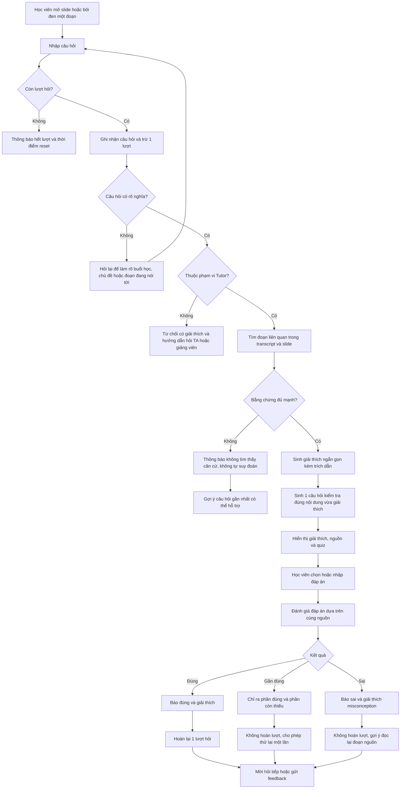
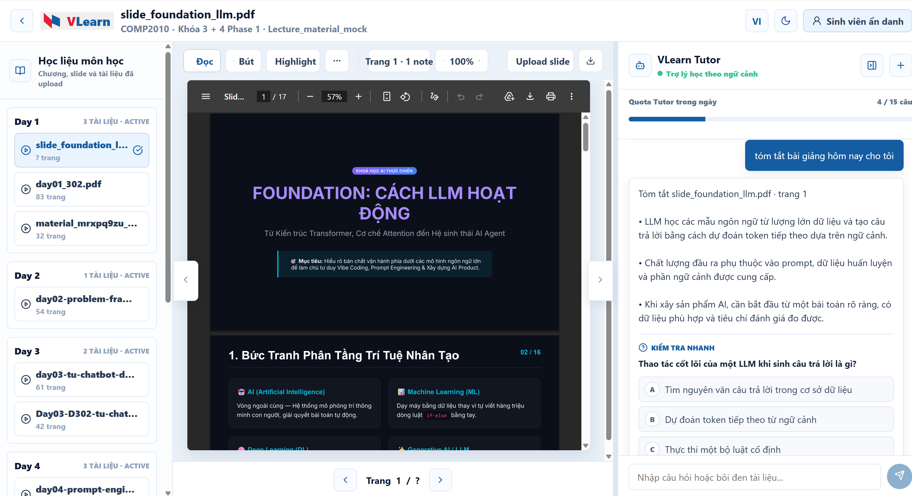
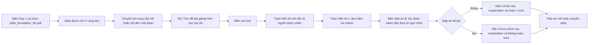
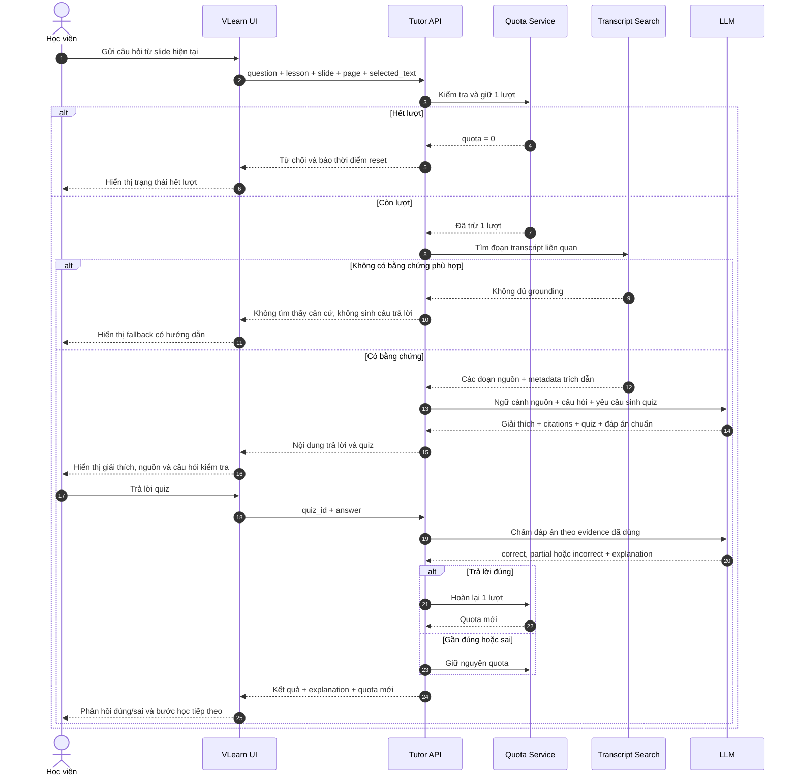
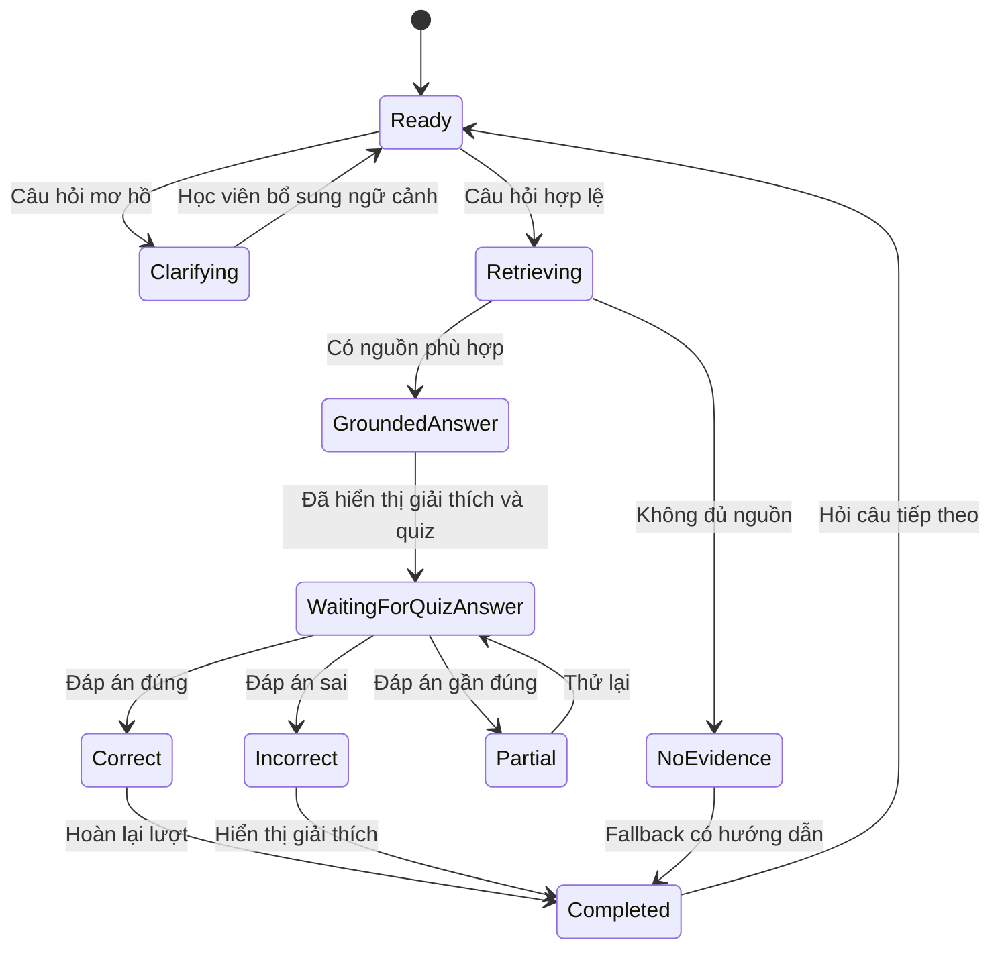

# Workflow VLearn Smart Tutor

Tài liệu này minh họa workflow chatbot dựa trên lát cắt và bằng chứng trong
[`CP1-canvas.md`](./CP1-canvas.md).

## 1. Mục tiêu của workflow

VLearn Smart Tutor hỗ trợ học viên ôn bài sau buổi học theo một vòng lặp ngắn:

1. Học viên hỏi về nội dung đang đọc.
2. Tutor giải thích dựa trên transcript và chỉ ra nguồn.
3. Tutor tự động đặt một câu hỏi kiểm tra hiểu bài.
4. Học viên trả lời và nhận phản hồi đúng/sai kèm giải thích.
5. Nếu trả lời đúng, hệ thống hoàn lại một lượt hỏi.

Workflow này xử lý pain chính trong CP1: **99,76% lượt giải thích trong dữ liệu
không có câu hỏi kiểm tra**, khiến học viên không biết mình đã hiểu đúng hay chưa.

## 2. Ngữ cảnh đầu vào

Mỗi yêu cầu gửi tới Tutor gồm:

| Nhóm dữ liệu | Trường |
|---|---|
| Ngữ cảnh khóa học | `course_id`, `lesson_id`, `slide_name`, `page` |
| Nội dung học viên | `question`, `selected_text` nếu có bôi đen |
| Trạng thái hội thoại | `conversation_id`, các message gần nhất |
| Trạng thái lượt hỏi | `user_id`, `quota_remaining`, ngày hiện tại |
| Nguồn học liệu | Transcript của buổi học, slide và metadata đoạn |

Tutor chỉ được khẳng định kiến thức khi tìm thấy bằng chứng phù hợp trong nguồn
học liệu. Nội dung ngoài nguồn phải được từ chối rõ ràng hoặc chuyển thành câu hỏi
làm rõ.

## 3. Workflow tổng thể



## 4. Luồng thao tác trên giao diện



Ảnh CP2 gồm ba vùng làm việc chính:

- **Bên trái — Học liệu môn học:** chọn ngày học và tài liệu.
- **Ở giữa — Slide viewer:** đọc, chuyển trang, zoom hoặc upload slide.
- **Bên phải — VLearn Tutor:** xem quota, gửi câu hỏi, đọc tóm tắt và làm quiz.

### 4.1 User journey trên giao diện



### 4.2 Thao tác

| Bước | Người dùng bấm/gõ | Kết quả trên giao diện |
|---|---|---|
| 1. Chọn bài học | Bấm `Day 1`, sau đó bấm `slide_foundation_llm.pdf` ở cột học liệu | Tài liệu được đánh dấu active và PDF mở ở vùng trung tâm |
| 2. Chọn ngữ cảnh | Cuộn tới trang cần học, bấm nút chuyển trang hoặc bôi đen một đoạn | Nhãn Tutor cập nhật thành `Ngữ cảnh: slide_foundation_llm.pdf · trang N`; nếu có selection thì ghi nhận đoạn đã bôi đen |
| 3. Đặt câu hỏi | Gõ `Tóm tắt bài giảng hôm nay cho tôi` vào ô chat | Nút gửi chuyển sang trạng thái sẵn sàng |
| 4. Gửi câu hỏi | Bấm biểu tượng gửi hoặc nhấn `Enter` | Câu hỏi xuất hiện thành bubble màu xanh; hệ thống giữ một lượt và bắt đầu xử lý |
| 5. Đọc câu trả lời | Không cần thao tác | Tutor hiển thị tóm tắt ngắn của slide/trang hiện tại; bản mục tiêu kèm trích dẫn transcript |
| 6. Làm quiz | Tại câu “Thao tác cốt lõi của một LLM khi sinh câu trả lời là gì?”, bấm đáp án `B — Dự đoán token tiếp theo từ ngữ cảnh` | Các lựa chọn bị khóa để tránh trả lời lặp |
| 7. Nhận phản hồi | Không cần thao tác | Hiện `Chính xác!`, explanation và hoàn lại một lượt hỏi |
| 8. Thử nhánh sai | Trong một lượt khác, chọn đáp án không đúng | Hiện `Chưa chính xác`, đánh dấu đáp án sai/đúng, giải thích misconception và không hoàn lượt |
| 9. Tiếp tục học | Bấm slide khác, chuyển trang, nút `+` để mở chat mới hoặc nút thu gọn Tutor | Context và vùng làm việc thay đổi tương ứng |

### 4.3 Trạng thái giao diện cần nhìn thấy

**Trước khi gửi**

- Tài liệu đang chọn có nền active.
- Nhãn context hiển thị đúng tên slide và trang.
- Quota hiển thị số lượt còn lại trong ngày.
- Ô chat nhận câu hỏi hoặc đoạn text đã bôi đen.

**Sau khi gửi**

- Câu hỏi của học viên nằm bên phải trong bubble màu xanh.
- Tutor trả một phần tóm tắt vừa nội dung, không để khoảng trắng thừa.
- Câu hỏi kiểm tra nằm ngay sau phần giải thích.
- Mỗi đáp án là một lựa chọn có thể bấm.

**Sau khi trả lời quiz**

- Đáp án đúng hiển thị màu xanh; đáp án sai đã chọn hiển thị màu đỏ.
- Phần explanation nói rõ vì sao đúng hoặc sai.
- Không thể submit lại cùng một quiz để nhận lượt nhiều lần.
- Quota được cập nhật ngay trên thanh tiến độ.

> Trong ảnh `demo-cp2.png`, quota `4 / 15` và nội dung tóm tắt đang là dữ liệu
> mock để chứng minh flow bấm được. Ở phiên bản tích hợp backend, quota phải được
> lưu theo người dùng/ngày và phần tóm tắt phải có grounding từ transcript.

## 5. Trình tự xử lý giữa các thành phần



## 6. Quy tắc quyết định

| Tình huống | Hành vi của Tutor | Cập nhật lượt |
|---|---|---|
| Câu hỏi rõ và có bằng chứng | Giải thích, trích dẫn và sinh quiz | Trừ 1 lượt khi nhận câu hỏi |
| Câu hỏi mơ hồ | Hỏi lại một câu để làm rõ, không tự đoán | Không trừ thêm lượt |
| Không có bằng chứng | Nói rõ không tìm thấy trong học liệu | Giữ lượt đã dùng hoặc hoàn lại theo policy sản phẩm |
| Ngoài phạm vi học thuật | Từ chối và hướng dẫn kênh phù hợp | Không trừ hoặc hoàn lại lượt |
| Quiz đúng | Báo đúng và giải thích vì sao | Hoàn lại 1 lượt, tối đa 15 |
| Quiz gần đúng | Chỉ ra phần thiếu và cho thử lại | Chưa hoàn lượt |
| Quiz sai | Giải thích misconception và dẫn lại nguồn | Không hoàn lượt |
| Quota bằng 0 | Không gọi LLM, báo giờ reset | Không thay đổi |

> Policy cần chốt ở CP3: câu hỏi bị từ chối do hệ thống không tìm được nguồn có
> được hoàn lượt hay không. Khuyến nghị hoàn lượt vì lỗi retrieval không phải lỗi
> của học viên.

## 7. Trạng thái một lượt học



## 8. Dữ liệu phản hồi đề xuất

API nên trả cấu trúc có thể kiểm tra được thay vì chỉ trả một chuỗi:

```json
{
  "answer": "LLM sinh nội dung bằng cách dự đoán token tiếp theo...",
  "citations": [
    {
      "session": "Day 1",
      "section": "12",
      "quote": "..."
    }
  ],
  "quiz": {
    "id": "quiz_01",
    "type": "multiple_choice",
    "question": "Thao tác cốt lõi của LLM là gì?",
    "options": [
      "Tìm nguyên văn trong cơ sở dữ liệu",
      "Dự đoán token tiếp theo",
      "Chạy bộ luật cố định",
      "Luôn tìm kiếm Internet"
    ]
  },
  "quota": {
    "remaining": 14,
    "limit": 15
  }
}
```

Đáp án đúng và rubric chấm không nên gửi xuống frontend trước khi học viên trả
lời. Frontend chỉ gửi `quiz_id` và đáp án lên API để chấm.

## 9. Guardrail và quality bar

- Không tạo citation nếu đoạn nguồn không tồn tại.
- Không trả lời kiến thức ngoài transcript như một sự thật đã được xác nhận.
- Câu hỏi kiểm tra phải đo đúng nội dung vừa giải thích.
- Phản hồi đúng/sai phải kèm lý do và cùng evidence với câu trả lời ban đầu.
- Mỗi lượt chỉ có một quiz đang chờ trả lời.
- Quota luôn nằm trong khoảng `0..15`; một quiz đúng chỉ được hoàn lượt một lần.
- Câu hỏi mơ hồ phải được làm rõ trước khi retrieval và gọi LLM.
- Các trường hợp deadline, điểm số hoặc quy định hành chính phải chuyển tới TA.

Quality bar đề xuất từ CP1:

1. Ít nhất 70% case trong golden set đạt toàn bộ tiêu chí.
2. Không có case bịa transcript hoặc citation.
3. 100% câu hỏi ngoài phạm vi được từ chối có giải thích.
4. 100% câu trả lời có giải thích đều đi kèm một check question phù hợp.

## 10. Mapping với prototype hiện tại

| Thành phần | Trạng thái hiện tại | Bước tiếp theo |
|---|---|---|
| Thu ngữ cảnh khóa học, slide, trang, đoạn bôi đen | Đã có | Chuẩn hóa ID thay vì chỉ dùng tên |
| Gọi LLM qua biến môi trường | Đã có | Ép output theo schema |
| Fallback tóm tắt + quiz | Đã có dạng mock | Grounding vào transcript thật |
| Chọn đáp án và hiện đúng/sai + explanation | Đã có trên frontend | Chuyển đáp án chuẩn và chấm điểm về server |
| Citation transcript | Chưa có | Thêm retrieval và metadata đoạn |
| Xử lý mơ hồ, ngoài phạm vi, thiếu evidence | Chưa đầy đủ | Thêm classifier/rule trước khi gọi LLM |
| Quota 15 lượt/ngày | Mới hiển thị mock | Lưu theo user và ngày, cập nhật atomically |
| Hoàn lượt khi quiz đúng | Chưa có | Thực hiện ở backend, chống submit lặp |
